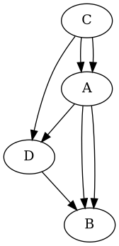

+++
weight = 20
plugins = ["https://cdn.jsdelivr.net/npm/reveal-plantuml"]

+++

## The Königsberg Bridge Problem

<!--  -->


> August 26, 1735, Leonard Euler

---
## Made a graph


---

## The solvable bridge problem


> Solutio problematis ad geometriam situs pertinentis

---

## In neo4j

```
CREATE (a:Land { name: "A" })
CREATE (b:Land { name: "B" })
CREATE (c:Land { name: "C" })
CREATE (d:Land { name: "D" })
CREATE (e:Land { name: "E" })
CREATE (f:Land { name: "F" })

CREATE (e)-[:BRIDGE {id: "a" }]->(f)
CREATE (f)-[:BRIDGE {id: "b" }]->(b)
CREATE (b)-[:BRIDGE {id: "c" }]->(f)
CREATE (f)-[:BRIDGE {id: "d" }]->(a)
CREATE (a)-[:BRIDGE {id: "e" }]->(f)
CREATE (f)-[:BRIDGE {id: "f" }]->(c)
CREATE (c)-[:BRIDGE {id: "g" }]->(a)
CREATE (a)-[:BRIDGE {id: "h" }]->(c)
CREATE (c)-[:BRIDGE {id: "i" }]->(d)
CREATE (d)-[:BRIDGE {id: "k" }]->(a)
CREATE (a)-[:BRIDGE {id: "m" }]->(e)
CREATE (e)-[:BRIDGE {id: "n" }]->(a)
CREATE (a)-[:BRIDGE {id: "p" }]->(b)
CREATE (b)-[:BRIDGE {id: "o" }]->(e)
CREATE (e)-[:BRIDGE {id: "l" }]->(d)

```

## Common graph problems

* Pathfinding
* Centrality
* Community detection
